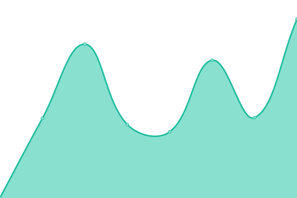
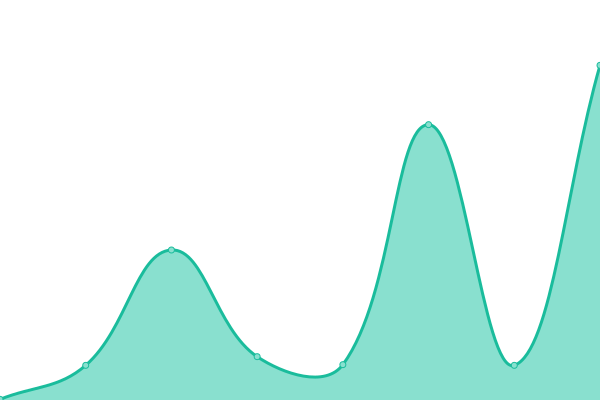
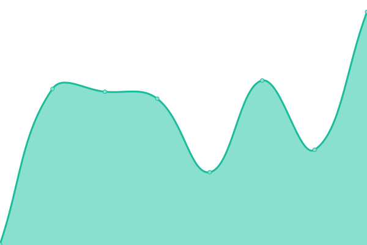

# [📈 Live Status](https://streamloots.github.io/upptime): <!--live status--> **🟩 All systems operational**

This repository contains the open-source uptime monitor and status page for [Streamloots](https://www.streamloots.com), powered by [Upptime](https://github.com/upptime/upptime).

With [Upptime](https://upptime.js.org), you can get your own unlimited and free uptime monitor and status page, powered entirely by a GitHub repository. We use [Issues](https://github.com/streamloots/upptime/issues) as incident reports, [Actions](https://github.com/streamloots/upptime/actions) as uptime monitors, and [Pages](https://streamloots.github.io/upptime) for the status page.

<!--start: status pages-->
<!-- This summary is generated by Upptime (https://github.com/upptime/upptime) -->
<!-- Do not edit this manually, your changes will be overwritten -->
<!-- prettier-ignore -->
| URL | Status | History | Response Time | Uptime |
| --- | ------ | ------- | ------------- | ------ |
|  [WWW - Landing](https://www.streamloots.com) | 🟩 Up | [www-landing.yml](https://github.com/streamloots/upptime/commits/HEAD/history/www-landing.yml) | 

 534ms
     
 | 

<a href="https://streamloots.github.io/upptime/history/www-landing">100.00%</a>
    

|  [WWW - Streamers](https://www.streamloots.com/streamers) | 🟩 Up | [www-streamers.yml](https://github.com/streamloots/upptime/commits/HEAD/history/www-streamers.yml) | 

 337ms
     
 | 

<a href="https://streamloots.github.io/upptime/history/www-streamers">100.00%</a>
    

|  [API](https://api.streamloots.com/heartbeat) | 🟩 Up | [api.yml](https://github.com/streamloots/upptime/commits/HEAD/history/api.yml) | 

 216ms
     
 | 

<a href="https://streamloots.github.io/upptime/history/api">100.00%</a>
    

|  [Widgets](https://widgets.streamloots.com/heartbeat) | 🟩 Up | [widgets.yml](https://github.com/streamloots/upptime/commits/HEAD/history/widgets.yml) | 

 208ms
     
 | 

<a href="https://streamloots.github.io/upptime/history/widgets">100.00%</a>
    

|  [Blog](https://blog.streamloots.com) | 🟩 Up | [blog.yml](https://github.com/streamloots/upptime/commits/HEAD/history/blog.yml) | 

 429ms
     
 | 

<a href="https://streamloots.github.io/upptime/history/blog">100.00%</a>
    

<!--end: status pages-->

[**Visit our status website →**](https://streamloots.github.io/upptime)

## 📄 License

- Powered by: [Upptime](https://github.com/upptime/upptime)
- Code: [MIT](./LICENSE) © [Streamloots](https://www.streamloots.com)
- Data in the `./history` directory: [Open Database License](https://opendatacommons.org/licenses/odbl/1-0/)
